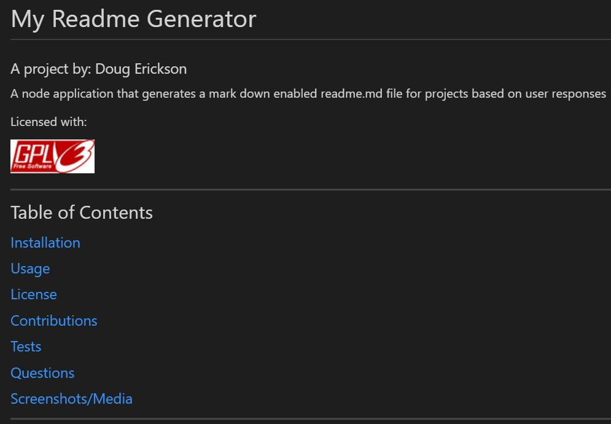

  # My Readme Generator 

  ### A project by: Doug Erickson 

  A node application that generates a mark down enabled readme.md file for projects based on user responses 

  Licensed with:

  

  ---
  ## Table of Contents
  ### [Installation](#installation)
  ### [Usage](#usage)
  ### [License](#license)
  ### [Contributions](#contributions)
  ### [Tests](#tests)
  ### [Questions](#questions)
  ### [Screenshots/Media](#media)
  ---
  ## Installation
  #### Requires NodeJS and the Inquirer package to run.

  ## Usage
  #### N/A

  ## License
  #### This project is using the GNU-GPL license.
  

  ## Contributions
  #### No guidelines at this time.

  ## Tests
  #### No testing required

  ## Questions
  #### noemail@noemail.com

  ## Media
  #### 
  